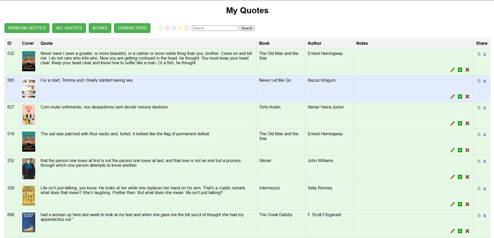
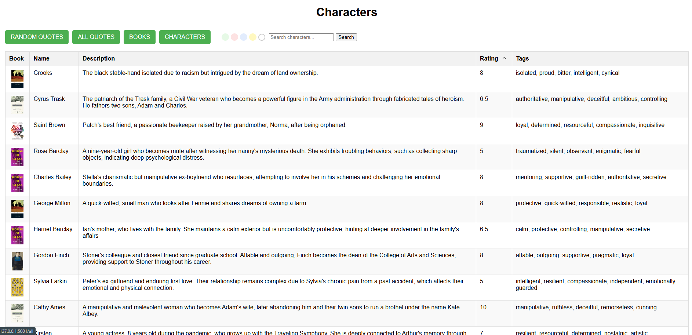
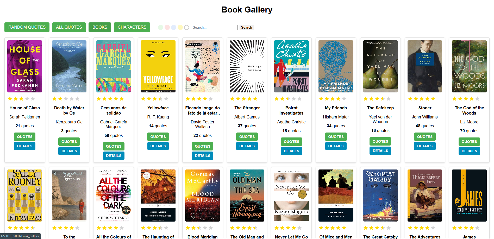
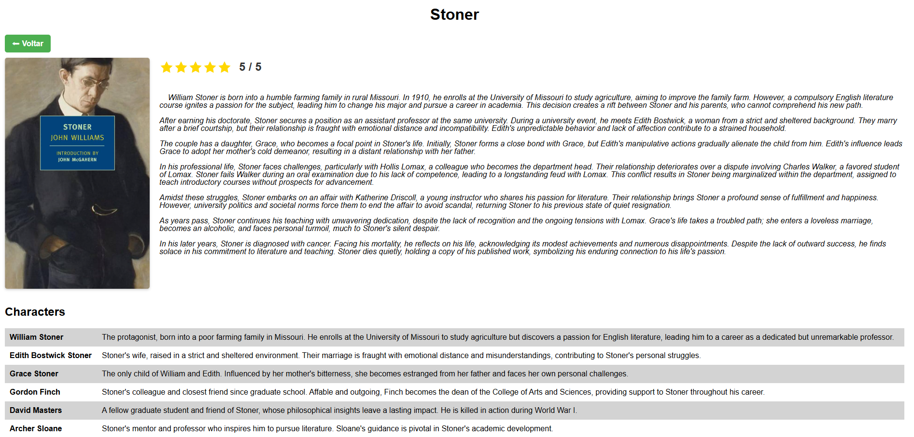

# 📚 My Quotes - Quote Management System

**My Quotes** is a web-based application designed to manage, organize, and visualize Kindle Highlights efficiently.

---

## 🖼️ Application Previews

### Quotes Table


### Characters Page


### Book Gallery


### Detailed Book View


---

## 🚀 Key Features

- **Random Quotes:** Display random quotes from your collection.
- **All Quotes:** Browse your complete library of saved quotes.
- **Books View:** Explore quotes grouped by book covers in a visual gallery.
- **Search Functionality:** Quickly search quotes, books, or authors.
- **Type Filters:** Filter quotes by categories (e.g., green, red, blue, yellow).
- **Notes Management:** Add, edit, or delete personal notes for each quote.
- **Interactive Table View:** View and manage quotes in an organized table format.
- **Dynamic Grid View:** Visualize book covers in a clean and modern grid layout.

## 🛠️ Technology Stack

- **Backend:** Flask (Python)
- **Database:** SQLite
- **Frontend:** HTML, CSS, JavaScript
- **Libraries:** Pandas (for data processing), SQLAlchemy (ORM)

## 📥 Data Import

- Supports importing Kindle highlights from a `.txt` file.
- Automatically processes and categorizes quotes.
- Prevents duplicate entries in the database.

## 💾 Data Organization

- **Books Table:** Stores book titles, authors, and cover URLs.
- **Quotes Table:** Stores quotes, page numbers, types, and notes.
- **Relationships:** Quotes are linked to their respective books.

## ⚙️ How to Run

1. Clone the repository:
   ```bash
   git clone https://github.com/marciomizuhara/MyQuotes.git
   cd MyQuotes
   ```

2. Install dependencies:
   ```bash
   pip install -r requirements.txt
   ```

3. Set up the database:
   ```bash
   flask db init
   flask db migrate
   flask db upgrade
   ```

4. Run the application:
   ```bash
   flask run
   ```

5. Access the app at: [http://127.0.0.1:5001](http://127.0.0.1:5001)

## 📂 Project Structure
```
My Quotes/
├── app.py	    # Main application logic
├── models.py	    # Database models
├── templates/	    # HTML templates
├── static/	    # CSS, JavaScript, and assets
├── import_excel.py # Kindle highlights importer
└── README.md	    # Project documentation
```

## 🌟 Future Improvements

- User authentication and profiles.
- Export quotes to PDF or Word.
- Enhanced analytics and reporting.

## 🤝 Contributing

Feel free to open issues or submit pull requests. Contributions are welcome!

## 📄 License

This project is licensed under the **MIT License**.

---